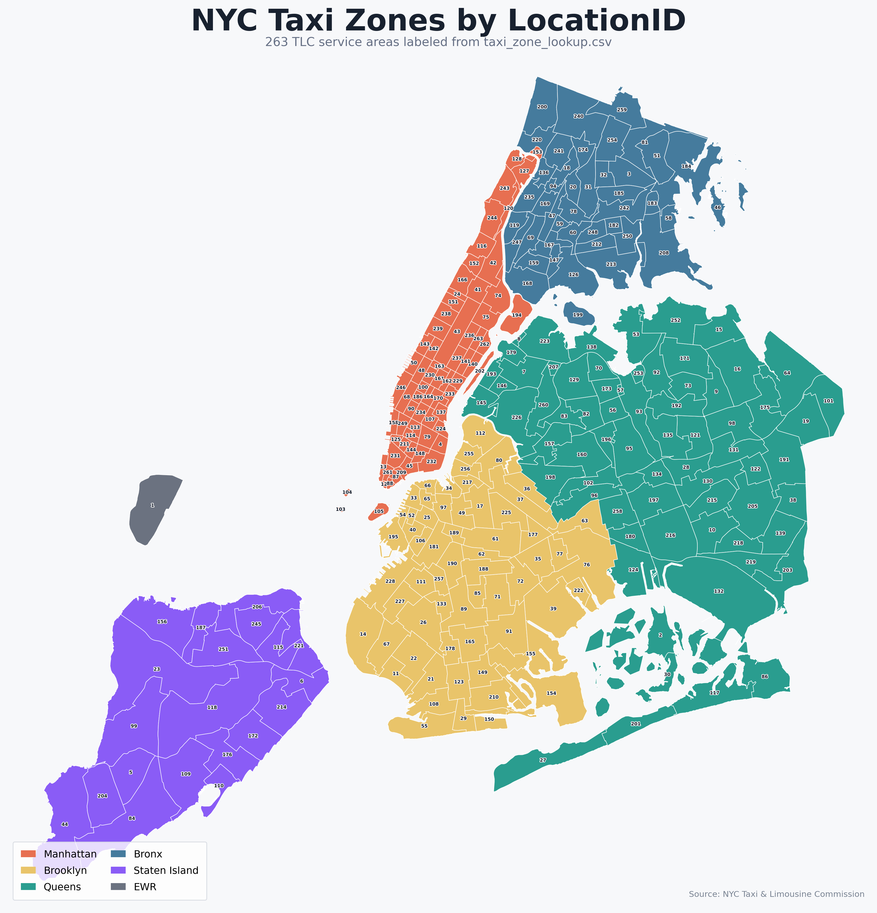

# New York Taxi Zone Recommendation

## 项目背景

出租车司机完成一笔订单后，需要决定下一步前往哪个区域等待乘客。不同区域在不同时段的订单需求、平均收入和前往成本不同，因此，推荐策略需要在潜在收益与移动成本之间进行权衡。

纽约市被划分为 263 个 Taxi Zone，区域编号为：

```text
1..263
```

一天被划分为 48 个半小时区间，编号为：

```text
time_slot = 0..47
```

例如：

```text
time_slot = 0   表示 00:00–00:30
time_slot = 1   表示 00:30–01:00
time_slot = 17  表示 08:30–09:00
time_slot = 47  表示 23:30–24:00
```

`weekday` 使用 Python 的编号约定，即周一为 0、周日为 6。当前时间可以表示为：

$$
current\_datetime=(weekday, timeslot)
$$

给定司机当前所在区域和当前时间：

$$
(current\_location,\ current\_datetime)
$$

算法需要返回三个推荐区域：

$$
[j_1,j_2,j_3]
$$

其中：

$$
j_1,j_2,j_3\in{1,\ldots,263}
$$

三个区域互不重复，并按照推荐优先级从高到低排列。

推荐时可以考虑：

* 下一时段各区域的历史订单需求；
* 各区域的平均订单收入；
* 从当前位置前往候选区域的移动时间；
* 工作日、周末和不同时段的需求差异。

项目提供一个连续模拟 28 天出租车运营过程的评测器，用于比较不同推荐策略的平均日收入和单次推荐耗时。



---

## 环境配置

推荐使用 Conda 创建独立环境：

```bash
conda create -n nyc-taxi python=3.11 -y
conda activate nyc-taxi
pip install -r requirements.txt
```

以下命令均从仓库根目录运行。

调用项目模块时，需要设置：

```bash
PYTHONPATH=src
```

例如：

```bash
PYTHONPATH=src python3 -m eval.evaluate \
  --strategy src/2_recommendation_algorithm/baseline_1.py \
  --output tmp/baseline_1_evaluation.json
```

---

## 项目结构

```text
data/
├── raw/                              # TLC 2023 年 1 月、2 月原始订单
├── meta/                             # 区域名称与地图边界
└── processed/                        # 清洗后数据、统计量和时间矩阵

src/
├── 1_data_clean/                     # Part 1：数据清洗
├── 2_recommendation_algorithm/       # Part 2：基础推荐算法
├── 3_extension_task/                 # Part 3：开放扩展任务
└── eval/                             # 统一模拟评测器

```

---

## 数据划分与使用规范

数据按时间划分：

* **训练集**：使用 2023 年 1 月前段订单，用于数据清洗、统计量构造和模型训练；
* **验证集**：使用 2023 年 1 月后段订单，用于选择参数、比较方案和调试策略；
* **测试集**：使用 2023 年 2 月订单，由统一评测器读取，用于最终模拟评测。

学生设计和调整策略时不得读取测试集文件：

```text
data/raw/yellow_tripdata_2023-02.parquet
```

不得根据测试集评测结果反复修改参数或规则，以避免测试集信息泄漏。

---

# Part 1：数据清洗


清洗代码统一放在：

```text
src/1_data_clean/
```

文件名和命令行接口不限，但必须能够从未清洗数据重新生成全部清洗结果和统计文件。

## 1.1 数据清洗

输入：

```text
data/processed/train_uncleaned.parquet
data/processed/validation_uncleaned.parquet
```

输出：

```text
data/processed/train_cleaned.parquet
data/processed/validation_cleaned.parquet
```

每行表示一笔订单。清洗后的文件保留原始订单中的全部字段，并增加：

```text
weekday
time_slot
trip_duration
```

字段定义：

```text
weekday        上车日期对应的星期编号，周一为 0，周日为 6
time_slot      上车时间所在的半小时编号，范围为 0..47
trip_duration  行程持续时间，单位为分钟，不需要离散化
```

其中：

$$
time\_slot =2\times hour+
\left\lfloor\frac{minute}{30}\right\rfloor
$$

例如：

```text
00:00 -> 0
00:30 -> 1
08:00 -> 16
08:30 -> 17
23:30 -> 47
```

行程持续时间为：

$$
trip\_duration = \frac{
dropoff\_datetime-pickup\_datetime
}{
60\text{ seconds}
}
$$


清洗数据时至少删除以下异常记录：

* `PULocationID` 或 `DOLocationID` 不在 `1..263`；
* 上车时间或下车时间缺失；
* 下车时间不晚于上车时间；
* 行程时间不超过 30 秒，即 `trip_duration <= 0.5`；
* 行程距离或费用等必要字段缺失；
* 重复订单；
* 行程时间、距离、费用或平均速度明显异常。

除行程时间必须严格大于 30 秒外，其他异常值阈值由学生自行确定，可先转化成csv文件对数据进行探索。

报告中需要说明：

1. 训练集和验证集的日期范围；
2. 清洗前后的订单数量；
3. 各项删除规则和异常值阈值；
4. 阈值的选择理由；
5. 各类规则删除的订单数量。

建议给出清洗统计表：

| 删除规则         |  删除行数 |
| ------------ | ----: |
| 无效区域编号       | 1,234 |
| 时间缺失或顺序错误    |   567 |
| 行程时间不超过 30 秒 |    89 |
| 距离或费用异常      |   345 |
| 速度异常         |   210 |
| 重复订单         |    76 |

## 1.2 训练集统计

只使用：

```text
data/processed/train_cleaned.parquet
```

生成：

```text
data/processed/zone_time_statistics.parquet
```

每行对应一个“上车区域、星期、半小时 slot”组合，需要遍历所有订单中包含的组合，没有历史订单的组合可以省略。一条数据包括：

```text
pickup_location_id  上车区域编号（键）
weekday             星期编号（键）
time_slot           半小时时段编号（键）
pickup_count        对应区域、星期和时段的历史订单数量（值）
mean_total_amount   平均订单总收入（值）
```

---


# Part 2：基础推荐算法

代码统一放在：

```text
src/2_recommendation_algorithm/
```

Part 2 包含三个推荐策略：

1. Baseline 1：热门区域；
2. Baseline 2：联合效用推荐；
3. 改进推荐算法。

所有策略必须提供完全相同的接口。

策略需使用统一评测脚本进行测试，详见[评测说明](src/eval/README.md)。需考虑策略的推荐质量和单次推荐耗时。

---

## 2.1 统一推荐接口

```python
from datetime import datetime


def recommend(
    current_datetime: datetime,
    current_location_id: int,
) -> list[int]:
    """Return three distinct LocationIDs in ranked order."""
```

返回值必须满足：

* 类型为 `list[int]`；
* 长度为 3；
* 包含三个不同的区域；
* 每个区域编号都在 `1..263`；
* 按照推荐优先级从高到低排列。

策略不需要读取测试输入文件，也不需要自行生成推荐结果 CSV。

统一评测器会动态导入策略文件并调用：

```python
recommend(current_datetime, current_location_id)
```

为了减少推荐耗时，建议在模块加载时完成统计文件和时间矩阵的读取，不要在每次调用 `recommend` 时重新读取大型文件。

---

## Task 1：Baseline 1 热门区域

完成：

```text
src/2_recommendation_algorithm/baseline_1.py
```

Baseline 1 使用下一半小时的历史上车订单数量作为区域分数：

$$
Score_1(j,s)=PickupCount(j,s+1)
$$

其中：

* $j$ 为候选区域；
* $s$ 为当前时段；
* $s+1$ 表示下一个半小时时段。

当当前时间接近一天结束时，需要正确处理日期和星期变化。

例如：

```text
Sunday 23:45
```

对应的下一时段应当是：

```text
Monday 00:00
```

需要完成模板代码中的 TODO：

1. 根据 `current_datetime` 找到下一个半小时对应的 `weekday` 和 `time_slot`，并为 263 个区域取得 `pickup_count`；
2. 对区域进行 Top-K 排序，返回分数最高的三个区域。

排序规则：

1. 分数更高的区域优先；
2. 分数相同时，区域编号更小者优先。

Baseline 1 不使用：

* 当前区域；
* 平均车费；
* 区域间移动成本。

Baseline 1 评测：

```bash
PYTHONPATH=src python3 -m eval.evaluate \
  --strategy src/2_recommendation_algorithm/baseline_1.py \
  --output tmp/baseline_1_evaluation.json
```
---

## Task 2：Baseline 2 联合效用推荐

Baseline 2 分为两个步骤：

1. 建立区域时间图并生成最短时间矩阵；
2. 根据需求、收入和移动时间计算联合效用。

---

### 2.1 建立区域时间图

完成：

```text
src/2_recommendation_algorithm/baseline_2_1.py
```

使用：

```text
data/processed/train_cleaned.parquet
```

建立包含 263 个节点的有向图。

具体步骤分为两部分。

1.使用历史订单构建有向图
将 263 个 Taxi Zone 作为图中的节点；
对每个存在历史订单的区域对 $A\rightarrow B$，统计平均行程时间；
建立有向边 $A\rightarrow B$，并将平均行程时间作为边权；
$A\rightarrow A$ 的订单也需要参与统计，用于估计车辆在同一区域内行驶所需的时间。

2.计算区域间最短时间
在构建的有向图上运行 Dijkstra 等最短路算法，计算任意两个不同区域之间的最短行程时间；
对于 $A\rightarrow A$，也应使用该区域历史订单的平均行程时间；如果没有对应订单，则填充为 10 分钟；

对于图中不可达的区域对，填充为 inf；
将结果保存为$263\times263$ 的时间矩阵。

需要注意，标准最短路算法通常会将节点到自身的距离设为 0，因此生成矩阵后需要按照上述规则重新设置对角线。

需要生成：

```text
data/processed/travel_time_matrix_dijkstra.csv
```

时间矩阵包含 $263 × 263$ 个时间值。

其中：

* 行表示出发区域；
* 列表示目标区域；
* 单位为分钟；


运行命令：

```bash
PYTHONPATH=src python3 -m 2_recommendation_algorithm.baseline_2_1
```

需要注意：

* 纽约 Taxi Zone 图是有向图；
* $A\rightarrow B$ 和 $B\rightarrow A$ 的平均时间可以不同；
* 对角线 $i\rightarrow i$ 的最短时间不为 0；
* 不得使用验证集或测试集订单构造时间矩阵。

---

### 2.2 计算联合效用

完成：

```text
src/2_recommendation_algorithm/baseline_2_2.py
```

对当前位置 (i)、候选区域 (j) 和当前时段 (s)，定义：

$$
Score_2(i,j,s)=
\frac{
\widehat{Demand}(j,s+1)
\times
\widehat{Fare}(j,s+1)
}{
TravelTime(i,j)+\lambda
}
$$

其中：

* $\widehat{Demand}(j,s+1)$ 数值等于 `zone_time_statistics.parquet`的`pickup_count`；
* $\widehat{Fare}(j,s+1)$ 数值等于 `zone_time_statistics.parquet`的`mean_total_amount`；
* `TravelTime(i,j)` 来自最短时间矩阵；
* 取 $\lambda=1$，避免分母为 0。

需要完成模板代码中的两个 TODO：

1. 为 263 个候选区域计算联合效用，不可达区域分数设为 0；
2. 实现 Top-K 排序，返回分数最高的三个区域。

排序规则：

1. 分数更高的区域优先；
2. 分数相同时，区域编号更小者优先。

baseline 2 评测：
```bash
PYTHONPATH=src python3 -m eval.evaluate \
  --strategy src/2_recommendation_algorithm/baseline_2_2.py \
  --output tmp/baseline_2_evaluation.json
```

---

## Task 3：改进推荐算法

在：

```text
src/2_recommendation_algorithm/improved_strategy.py
```

中实现一个自己的推荐策略，并保持统一接口：

```python
def recommend(
    current_datetime: datetime,
    current_location_id: int,
) -> list[int]:
    ...
```

策略需要返回三个不重复的区域编号，并按照推荐优先级从高到低排列。

完成 TODO 并删除模板中的 `NotImplementedError` 后，可以运行：

```bash
PYTHONPATH=src python3 -m eval.evaluate \
  --strategy src/2_recommendation_algorithm/improved_strategy.py \
  --output tmp/improved_strategy_evaluation.json
```

统一评测器对出租车的移动、接单、收入和时间推进过程进行了简化建模。该模拟方式只是对实际运营过程的一种近似，并不存在脱离具体假设的“唯一最优策略”。学生可以阅读评测器的规则，理解其中的状态转移和收入计算方式，并针对该模拟环境设计推荐策略。

建议尽量使策略在统一模拟中取得高于 Baseline 1 和 Baseline 2 的平均收入，但最终收入不直接作为评分标准。评分更关注问题分析、算法设计、实现正确性、复杂度和实验分析。

我们鼓励自行设计算法，也可以参考以下方向。

### 方向一：重新设计效用函数

在 Baseline 2 的基础上，重新设计候选区域的评分方式，例如考虑：

* 需求、平均收入和移动时间的不同权重；
* 单位时间的预期收入；
* 评测器中的接单概率和等待成本；
* 不同特征的归一化；
* 数据稀疏或需求波动带来的风险。

如需优化参数可以使用验证集参考评测脚本构建模拟器进行调参，不得使用测试集进行调参。

### 方向二：多步动态规划

Baseline 1 和 Baseline 2 只考虑当前一次推荐。学生可以根据评测器的时间推进方式，进一步考虑未来多个时段的累计收益。

建议规划未来 2 至 4 步，可以使用：

* 枚举搜索；
* 动态规划；
* 有限深度搜索；
* Beam Search。

例如，可以定义：

$$
V_h(i,t)=
\max_j
\left(
R(i,j,t)+V_{h-1}(j,t')
\right)
$$

其中，$h$ 为剩余规划步数，$R(i,j,t)$ 为从区域 $i$ 前往区域 $j$ 后获得的预期单步收益，$t'$ 为完成移动或订单后的下一决策时刻。

实际实现时，应根据评测器的 slot 推进规则确定 $t'$，不一定简单等于 $t+1$。

最终仍然返回当前时刻排名最高的三个候选区域。

### 方向三：搜索与启发式算法

也可以使用搜索或启发式方法改进推荐过程，例如：

* 贪心搜索；
* 启发式搜索；
* 候选区域筛选与剪枝；
* 局部搜索；
* 参数网格搜索；
* 根据评测器规则设计的其他启发式策略。

需要说明算法如何利用当前问题和模拟器的特点，以及它相较于 Baseline 的改进之处。

我们也允许提出其他策略，需要明确说明：

* 优化目标；
* 使用的数据；
* 推荐分数或搜索过程；
* 参数选择方法；
* 算法复杂度。

---

## 第 3 题最低要求

报告至少需要包含：

1. 对统一评测器建模假设的理解；
2. 改进策略的基本思想；
3. 优化目标、评分公式或伪代码；
4. 使用的数据和参数；
5. 参数如何通过验证集确定；
6. 算法时间复杂度；
7. 与 Baseline 1、Baseline 2 的平均日收入比较；
8. 单次推荐的平均耗时；
9. 对实验结果和失败情况的分析。

策略可以针对统一评测器中的模拟规则进行设计，但不得读取二月测试订单，也不得根据测试集结果反复修改参数。


# Part 3：开放扩展任务

代码统一放在：

```text
src/3_extension_task/
```

Part 3 为开放选做任务。学生可以结合订单数据、区域统计、时间矩阵和评测器的形式，自行提出一个具体问题，并完成建模、实现、实验和结果分析。

可以参考以下方向，也可以设计其他合理题目。

关于出租车网约车的数据集可参考：
https://www.nyc.gov/site/tlc/about/tlc-trip-record-data.page
## 方向 1：数据分析与交互式推荐系统

分析不同区域在一天内的需求、收入、行程距离和订单时长等特征，并将分析结果与推荐算法结合，搭建一个可交互的小型系统。

系统可以支持：

* 输入当前时间和区域；
* 展示 Top-3 推荐区域；
* 在地图上显示推荐结果；
* 展示区域的需求变化和基本特征；
* 比较不同推荐算法的结果；
* 解释各区域被推荐的原因。

系统必须实际调用推荐算法，并包含数据分析或算法比较功能，不能只制作静态页面。

## 方向 2：更准确的需求与收入预测

前面的 Baseline 直接根据训练集统计不同区域、星期和时段的平均需求与收入。这种方法实现简单，但无法充分利用长期变化、近期趋势和区域之间的联系。

学生可以下载更多历史订单数据，构造更丰富的时间和区域特征，并使用机器学习或神经网络预测未来时段的：

* 订单需求；
* 平均订单收入；
* 接单概率；
* 单位时间预期收益。

需要将预测结果用于自己的推荐策略，并比较：

1. 预测结果是否优于直接使用历史统计量；
2. 更准确的预测是否能够提高模拟收入。

数据必须按照时间划分，不能随机打乱训练集和验证集，也不能使用测试时间之后的信息预测过去。

## 方向 3：多车辆模拟与联合调度

前面的任务只考虑一辆出租车。学生可以自行构建一个多车辆模拟器，研究多辆车同时运营时的调度问题。

可以考虑：

* 同一区域车辆过多造成的竞争；
* 不同区域的订单容量；
* 车队规模对总利润和单车利润的影响；
* 如何分配车辆以减少乘客等待时间；
* 如何使不同司机之间的收入更加均衡；
* 如何在服务质量、车队利润和司机公平性之间进行权衡。

可以进一步研究在给定订单需求下，最合适的车辆数量和调度方式。

需要清楚定义模拟器的运行规则、优化目标和评价指标，并将联合调度方法与每辆车独立推荐的方法进行比较。

## 方向 4：强化学习策略

学生可以下载更多历史订单数据，并根据数据构建一个出租车运营模拟环境。

在模拟环境中，司机根据当前位置、星期和时段选择下一个区域，环境返回接单结果、收入、耗时和新的位置。学生需要自行定义：

* 状态；
* 动作；
* 奖励；
* 状态转移；
* 环境中的随机性。

在此基础上训练强化学习策略，并在独立测试数据或统一评测器上评价效果，与随机策略和已有推荐算法进行比较。

需要说明强化学习策略是否获得了更高的长期收益，以及结果主要来自算法本身还是模拟环境的建模方式。

## 方向 5：自拟题目

也可以根据现有数据自行设计其他问题，例如：

* 异常订单检测；
* 更合理的区域移动时间估计；
* 不同风险偏好的推荐策略；
* 推荐结果解释；
* 在线更新区域统计；
* 推荐服务接口；
* 数据库与查询系统；
* 算法效率和内存优化。

自拟题目需要明确说明：

```text
1. 要解决什么问题？
2. 输入和输出是什么？
3. 使用哪些数据？
4. 如何建模和实现？
5. 使用什么指标评价？
6. 与什么基础方法比较？
```
